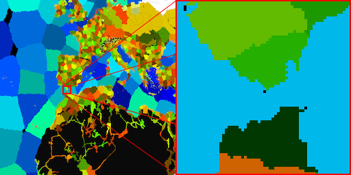

*[DBI]: Discrete Bilinear Interpolation

A description of a pixel sampling algorithm I started using for a long term project of mine.

## Motivation

This long term project involves rendering a map of the world among other challenges. Going at it I quickly found out how even 16K images were not enough when zooming in at otherwise (in other similar projects) reasonable levels, for example:



If, when zooming in enough, we use a Nearest Neighbors filter on the fragment shader, each pixel on the screen will adopt the color of the nearest square and produce a pixelated look. It is possible to mitigate this problem in at least two main ways:

- **Bilinear interpolation**. The 4 nearest squares' colors (up, down, left, right) are sampled, weighted according to their distance, and mixed.


The result is a color gradient appearing, blurring the frontier between different colors. It solves the problem of blocky edges and serrated diagonals, but introduces blur. For images with sharp color gradients as in this one, blocks can still be seen:


- **Stacked noise layers**. Adding noise (i.e. 2D Perlin) to the x and y coordinates of the pixel at different noise levels can create the perception of fine details and stray further from the pixelated look. Nearest neighbors and 3 layers of noise:


Noise works quite well alone, but combining it with bilinear interpolation doesn't:


Bilinear interpolation performs well in a regular texture, but not for one with discrete values. For example, instead of terrain let's imagine we have a province map with 4 thousand territories, each one represented by a unique integer. Other instances of similar behaviors could be ownership and terrain type maps, anything that represents discrete values instead of continuous colors. In this case, if we were to use bilinear interpolation and there was a spot surrounded by, let's say, province IDs 200, 1, 1 and 1, the bilinear average could be any float between 200 and 1. Rounding doesn't solve the issue, because the result should be either 1 or 200, not any province with an ID in between. This works only with binary states like sea/land.


## Discrete bilinear interpolation

The following is my approach to tackle the problem, with good results:


The effect of DBI or a binary clamped bilinear interpolation on high detail is the appearance of diagonals and rounded edges which improve the natural look considerably. A square turns into a circle, a serrated line turns into a clean diagonal. It's too straight though, so we employ noise to arrive to a good final result. It can also be observed how noise with nearest neighbors still retained some of the blocky aspect on large features, but not here.

### The algorithm

Let's imagine a screen pixel in the original coordinates of the image like in the 2^nd^ figure:

```vhdl
procedure DBI
    left, right, top, bottom values are sampled (A, B, C, D)
    color = [A,B,C,D]
    score[0] = (Ax-Px)(Ay-Py), score[1] = (Bx...)
    cumulativeScores = [.0, .0, .0, .0]
    for i = 0...3
       for j = 0...3
          if color[i] == color[j]
             cumulativeScores[i] += score[j] 
          end
       end
    end
    chosenColor = color[argmax(cumulativeScores)]
end procedure
```

The formula is fundamentally the same as in bilinear interpolation, but it can't be done in a few operations if the end color has to be discrete and the inputs are non-continuous.
