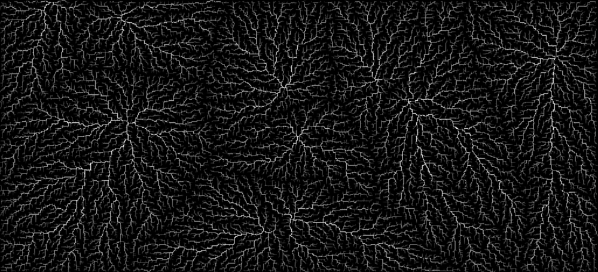

[**Run DLA**](../../content/JSexperiments/GPUdla/index.html)
======

---

An implementation of the Diffusion-Limited Aggregation algorithm using GPU compute shaders through WebGPU, in JavaScript. You can try it yourself [if your browser supports WebGPU](https://caniuse.com/?search=web%20gpu).

Example result:



The core idea is to place seeds on a space and spawn walkers that move randomly until colliding with one of them, freezing in place.  Main variants include those subdividing the space in a grid and those with a particle system.

I found a particular example that for every iteration it spawned a walker, moved it randomly for a maximum number of steps and froze it if it collided. Each frozen particle has a single parent and when a collision event occurs, it updates the hit count for the collided particle and all its ancestors up until the seeds. The hit count is what's used for coloring the image.

## Adapted algorithm

I decided to go for the previously mentioned algorithm because grid based DLA is easier to scale up in parallel. I changed the walkers part though, because it would cause severe thread branching as some particles would hit right away but others take much longer, with these ones dictating the pace. Instead I activate and move cells on every iteration, recording how many movements it did since inception. If a collision happens but the number of moves is below a threshold, it's deemed non valid, filtering out particles that randomly spawned too close to the frozen set. After the simulation goes on for a while I check if the number of frozen particles doesn't change in X number of iterations, and if so the threshold is halved. Smaller and smaller branches grow, eventually filling the picture completely.

```vhdl
-- Algorithm concept
procedure DiffusionLimitedAggregation
    Place seed/s on X*Y array
    
    while threshold > 0
    	for every cell
            if inactive
            	small chance to turn active
            else if active
            	if neighbor is frozen
                    if totalMoves < threshold
                        die
                    else
                        freeze
                        increase frozen cell count
                    end
                end
            	move and increase totalMoves       	
            end
        end
    end
end procedure
```