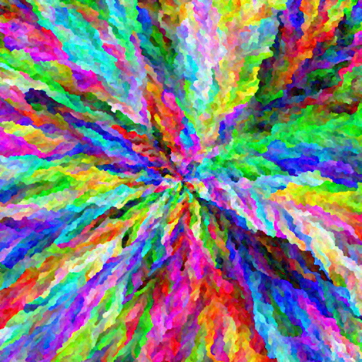
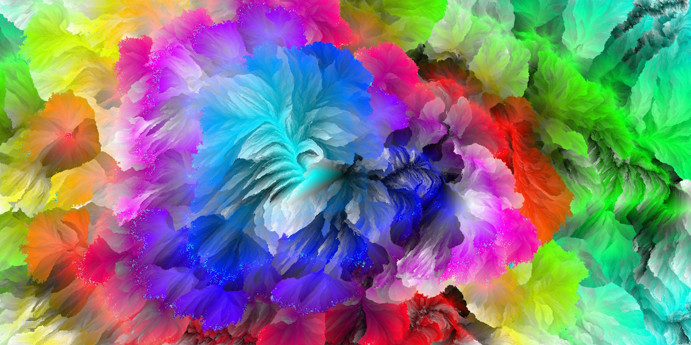
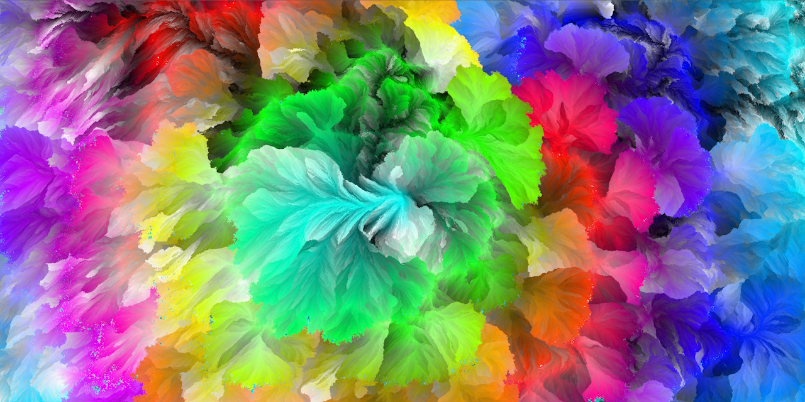

[**Run Rainbow Smoke**](../../content/JSexperiments/GPUrainbowSmoke/index.html)
======

---

An implementation of the Rainbow Smoke algorithm using GPU compute shaders through WebGPU, in JavaScript. You can try it yourself [if your browser supports WebGPU](https://caniuse.com/?search=web%20gpu).

Example result:



[toc]

## History

Rainbow Smoke belongs to the generative art class of computer algorithms. Its origins lie in this Code Golf Stack Exchange [post](https://codegolf.stackexchange.com/questions/22144/images-with-all-colors) from 2014. The Code Golf site hosts many coding challenges. In this case it was a 1-week popularity contest launched by the community with the goal of finding the best approach to a simple problem, in summary: 

- Create an image purely algorithmically, that is, not using pictures or external information.
- Each pixel must have a unique color.
- Colors must evenly fill the RGB spectrum.


There were many interesting submissions, but "Rainbow Smoke", submitted by Hungarian user fejescoco, quickly became the clear winner. He himself hosts a little [website](http://rainbowsmoke.hu/home) where you can see a gallery of images crafted using his work, links to videos and articles talking about it. Indeed several news agencies back then picked up on the contest winner and it became quite popular. He explained it in a very graphic way here:

<iframe width="640" height="360" src="https://www.youtube.com/embed/OuvFsB4SLhA" allowfullscreen></iframe>

Throughout the years people interested on the subject have imagined different ways of building up on it, an example:

<iframe width="640" height="360" src="https://www.youtube.com/embed/dVQDYne8Bkc" allowfullscreen></iframe>

## The Algorithm

The original implementation was a CPU single-threaded C# code with some performance issues, but enough for the mandatory 256x128 pixel image of the contest. However, to deliver on higher resolutions (and he went up to 4k, which you can see on his website) the code had to be improved on performance and partly made parallelizable. Simple version of it:

```vhdl
procedure RainbowSmoke
    Create unique color X*Y array
    Shuffle order
    Place seed/s on new X*Y cell array
    Activate seed/s neighbors
    for i in range(X*Y)
        Pick color i
        for every active cell
            distance = average or minimum L2-norm difference between picked color and painted neighbors
        end
        Paint active cell with the smallest distance
        Activate its neighbors
        Display cell array
    end
end procedure
```

There are many parameters you can change to obtain different looking images (although thanks to random shuffling, each result is probably unique):

- **Average or minimum variants**. Severely influences the growth pattern.
- **Seed/s starting location**
- **Image resolution**. Larger images produce better and better results.
- **Shuffling order.** Instead of using randomness, the colors can be ordered using other properties such as **hue**.

Other techniques not used in the initial post:

- **Distance modifiers.** Randomness, constant values or even a flow field added to the distance.
- **Initial color array**. As shown by Generative Garden, you could instead sample the colors from other pictures.

Performance enhancements and iterations later, the algorithm allowed fejescoco to create 4K images, images which are frankly stunning. As said by him and as it can be deduced from looking at the pseudocode, the most expensive operation is the distance calculation part. For example, in a 4K image, even if only 10% of the pixels are active, that still means 1.6M active cells, and then 8 checks per cell for the neighbors, with an additional math operation for each painted one. This is something GPUs are very well built to compute.

### Working up to it

I tried different versions and approaches, finding incremental improvements:

- **p5.js** - Single-threaded on the CPU, no optimizations whatsoever.
- **V0 (ST CPU argmin)** - From here, everything is coded on JS and WebGPU. On each iteration, the target color is sent to GPU memory, the distance array is brought back through a staging buffer, the CPU does an argmin operation and the index found is again sent. Obviously so many memory transfers are very inefficient, but it was a great learning experience. I had many problems using this approach also due to GPU synchronization issues.
- **V1 (no CPU transfers)** - Everything is sent to the GPU at the start and each iteration is handled through the different compute shaders, the calls for which are now batched together and several iterations may take place before a draw call. The argmin operation is done now by a single GPU thread, which is still not optimal.
- **V2 (parallel reduction)** - Parallel reduction is now used to calculate the minimum of the distance array. There is an issue with ties between equal numbers, where it pushes the growth towards one edge always, so I added a small custom made pseudorandom number to the distance calculation.
- **V3 (bit packed colors)** -  I swapped my own PRN generator code for the PCG hash and took out the square root of the L2-norm because it is not necessary, the patterns have improved. Colors are now 4-bit 0-255, packed into a single uint32 instead of 3 f32s and unpacked when needed, which should lower data transfer volumes considerably.

For posterity, I benchmarked the different procedures, making increasingly larger images using the average variant, random colors and center start, done on a i5-12400+RTX2060 machine. I added the original author's final algorithm as well, extrapolated from a comment at the end of his post:

`I can now render huge images in 5-10 hours. I already have some 4Kx4K renders`

I then assumed computation time to be scaling quadratically with the resolution, and 5 h for 4096^2^ images.

<div class="flourish-embed flourish-chart" data-src="visualisation/21875906"><noscript></noscript></div>

The result so far already scales far better and produces similar outputs, two key goals of mine when I started working my way up through both the algorithm and using WebGPU. It has served me also to understand many key optimization and architectural concepts in GPU computing because it's quite different from my experience using CPUs.

## Some results from 4K resolution




