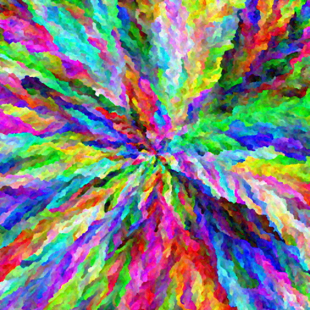
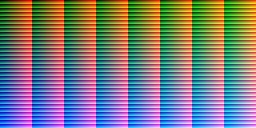

An implementation of the Rainbow Smoke algorithm using GPU compute shaders through WebGPU, in JavaScript. You can try it yourself [if your browser supports WebGPU](https://caniuse.com/?search=web%20gpu):

[Web implementation of Rainbow Smoke](../../content/JSexperiments/GPUrainbowSmoke/index.html)

Example result:

::: center



512x512 resolution, average variant and random color shuffling

:::

[toc]

## History

Rainbow Smoke belongs to the generative art class of computer algorithms. Its origins lie in this Code Golf Stack Exchange [post](https://codegolf.stackexchange.com/questions/22144/images-with-all-colors) from 2014. The Code Golf site hosts many coding challenges. In this case it was a 1-week popularity contest launched by the community with the goal of finding the best approach to a simple problem, in summary: 

- Create an image purely algorithmically, that is, not using pictures or external information.
- Each pixel must have a unique color.
- Colors must evenly fill the RGB spectrum.

The example image, which technically fulfills the requirements but is not artistically pleasing:
::: center

:::

There were many interesting submissions, but "Rainbow Smoke", submitted by Hungarian user fejescoco, quickly became the clear winner. He himself hosts a little [website](http://rainbowsmoke.hu/home) where you can see a gallery of images crafted using his work, links to videos and articles talking about it. Indeed several news agencies back then picked up on the contest winner and it became quite popular. He explained it in a very graphic way here:

[](https://www.youtube.com/watch?v=OuvFsB4SLhA)

Throughout the years people interested on the subject have imagined different ways of building up on it, an example:

[](https://www.youtube.com/watch?v=dVQDYne8Bkc)


## The algorithm

The original implementation was a CPU single-threaded C# code with some performance issues, but enough for the mandatory 256x128 pixel image of the contest. However, to deliver on higher resolutions (and he went up to 4k, which you can see on his website) the code had to be improved on performance and partly made parallelizable. Simple version of it:

```vhdl
procedure RainbowSmoke
    Create unique color X*Y array
    Shuffle order
    Place seed/s on new X*Y cell array
    Activate seed/s neighbors
    for i in range(X*Y)
        Pick color i
        for every active cell
            distance = average or minimum L2-norm difference between picked color and painted neighbors
        end
        Paint active cell with the smallest distance
        Activate its neighbors
        Display cell array
    end
end procedure
```

There are many parameters you can change to obtain different looking images (although thanks to random shuffling, each result is probably unique):

- **Average or minimum variants**. Severely influences the growth pattern.
- **Seed/s starting location**
- **Image resolution**. Larger images produce better and better results.
- **Shuffling order.** Instead of using randomness, the colors can be ordered using other properties such as **hue**.

Other techniques not used in the initial post:

- **Distance modifiers.** Randomness, constant values or even a flow field added to the distance.
- **Initial color array**. As shown by Generative Garden, you could instead sample the colors from other pictures.

Performance enhancements and iterations later, the algorithm allowed fejescoco to create 4K images, images which are frankly stunning. As said by him and as it can be deduced from looking at the pseudocode, the most expensive operation is the distance calculation part. For example, in a 4K image, even if only 10% of the pixels are active, that still means 1.6M active cells, and then 8 checks per cell for the neighbors, with an additional math operation for each painted one. This is something GPUs are very well built to compute.

### My GPU implementation

This was my second WebGPU project so it has been quite a learning experience. Last year I finished a code that only did the rendering and distance calculation on the GPU. Each iteration I used staging buffers to:

- Move the picked or target color to a GPU buffer
- Move the entire distance array back to the CPU, to calculate there the minimum
- Return the index of the minimum to another GPU buffer, and then 

This was done because I didn't know how to parallelize a find minimum operation. After fighting strange bugs due to the staging part being not trivial to synchronize, the result was massive transfers on every frame, especially due to the distance array, which is not optimal. Still, it was relatively quick (though, much slower than the last C# version on a CPU). 

This year I came back to it, and decided to move all the operations on the GPU. Now instead I moved all arrays into GPU buffers at the beginning and performed the same calculations there. Even though I was still using a single thread to calculate the minimum, the performance was 10 to 20 times better. The next improvements:

- Use parallel reduction instead of finding minimums with a single thread
- On every iteration, the number of active cells only changes by -1 or +5, could there be a way to exploit this?

[wip]
