Here I show the flashy bits of some of the assignments I did during the masters, acknowledging that most of the actual work doesn't make it into a nice graph or animation.

[toc]

# Assignments with animations

## Orbital Mechanics [OM]

Earth **Molniya orbit design** given some basic orbit parameters, with the objective of comparing to a real life object found through publicly available data and **modelling** the most important **perturbations**, in **MATLAB**. This was one of the most interesting projects I did, and motivated me to read a chapter of a book about perturbations, and implementing the **EGM96** model, relativistic effects, etc.

I went ahead and did these two animations using the same software. That was probably a mistake, it was hell on Earth to make, and motivated me to learn **Blender** for the same purpose later.

<iframe width="640" height="360" src="https://www.youtube.com/embed/nJ_P-hUO-3g" allowfullscreen></iframe>

<iframe width="640" height="360" src="https://www.youtube.com/embed/ByNQOdoczXE" allowfullscreen></iframe>

Some figures:

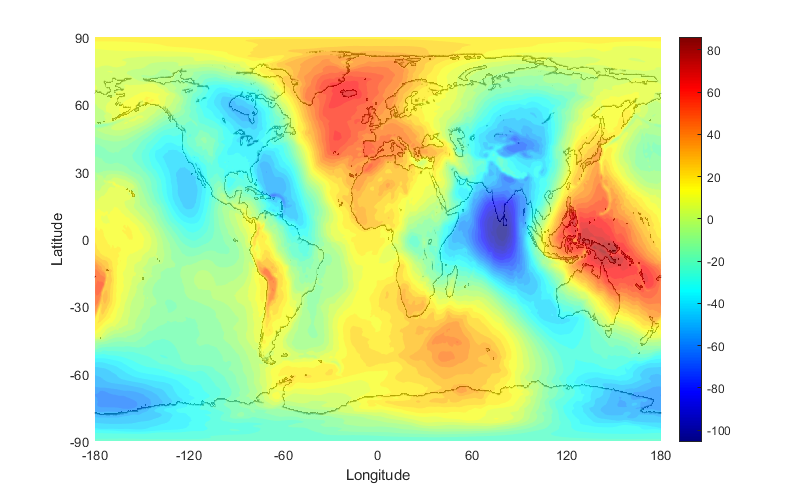

The project had a second part about an **interplanetary transfer**.

## Spacecraft Attitude Dynamics [SAD]

Control and simulation of satellite attitude dynamics using **MATLAB Simulink**. Orbit trajectory computed using **MATLAB** and drawn with **Blender**.

<iframe width="640" height="360" src="https://www.youtube.com/embed/B0lHIo_tt7I" allowfullscreen></iframe>

## Launch Systems [LS]

Concept design of a 3-stage partially recoverable (parachute) **missile system** to deliver a non-military payload with a range of ~250km. Missile trajectory computed with **MATLAB** and drawn with **Blender**.

<iframe width="640" height="360" src="https://www.youtube.com/embed/rTtfvdIVifg" allowfullscreen></iframe>

# Other assignments

Some were omitted.

## Space Systems Engineering and Operations [SSEO]

Preliminary design of the **New Horizons** mission to Pluto and the **Juno** mission to Jupiter through reverse engineering. The different major subsystems were designed with the depth one would expect from a systems engineering standpoint at a Pre-A stage, including: mission definition (goals, drivers, phases...), mission analysis (mainly trajectory), propulsion, telecommand & telecommunications, attitude control, thermal control, electrical power, on-board data handling and configuration. Some figures from the Juno assignment:

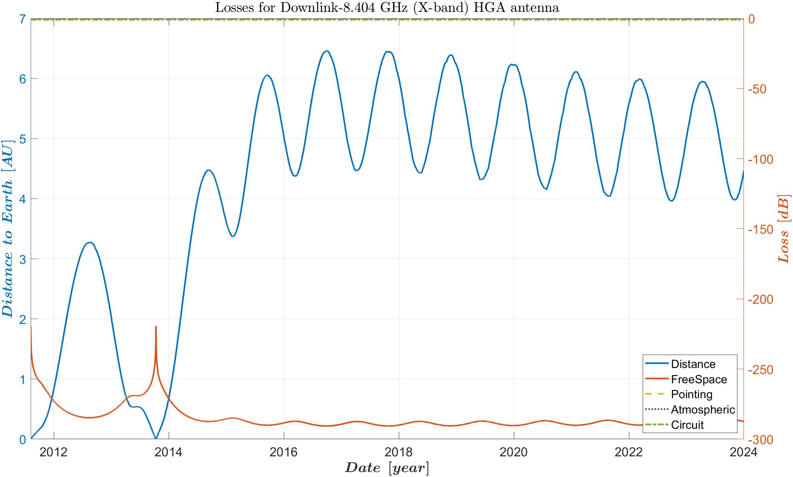

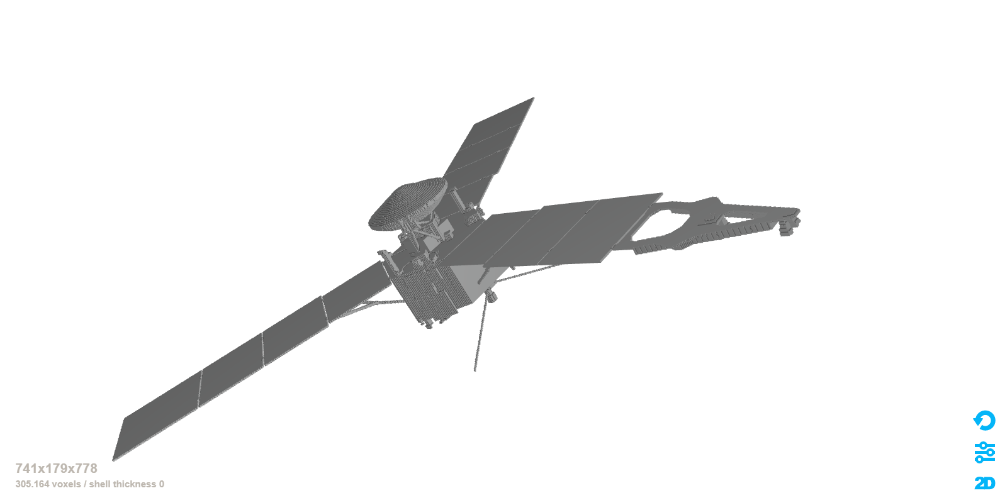

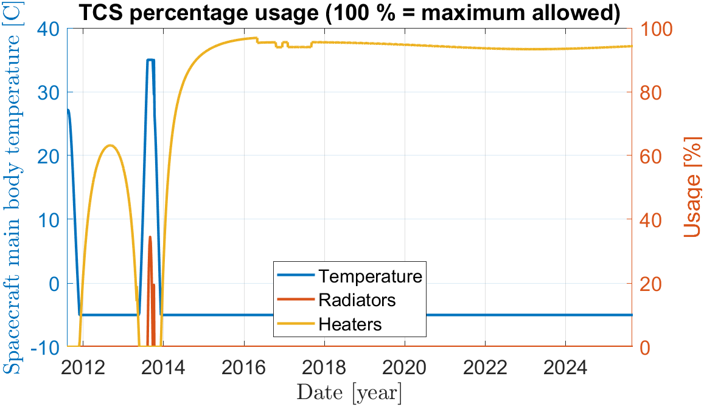

## Space Propulsion [SP]

One-week long workshop for the design of a **pressure-fed liquid propellant rocket motor**. The team and task was considerable, and the time available was very short, but it ended up being one of the most unique projects I've ever done. I used **MATLAB** for the parts I worked on: **thermal analysis**, **basic injector design** and **cooling solutions** (ablative, heat sink, regenerative, liquid film). The design was to be performed for two propellant pairs (one more eco-friendly than the other) and three thrust targets (nominal, half and double thrust). Here are some images for the nominal thrust with the (more) toxic propellant pair of MMH (monomethyl hydrazine) and NTO (nitrogen tetroxide):

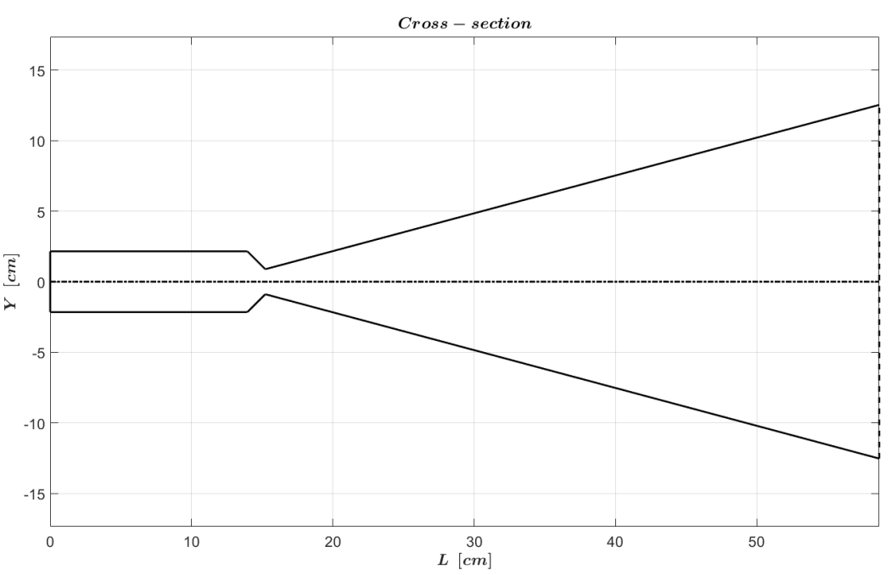

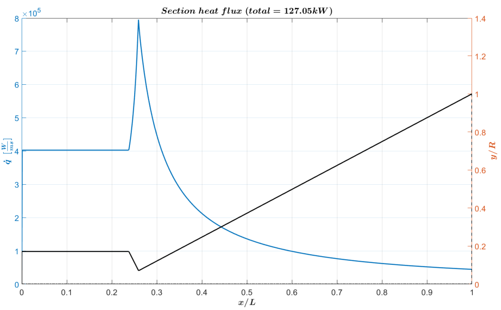

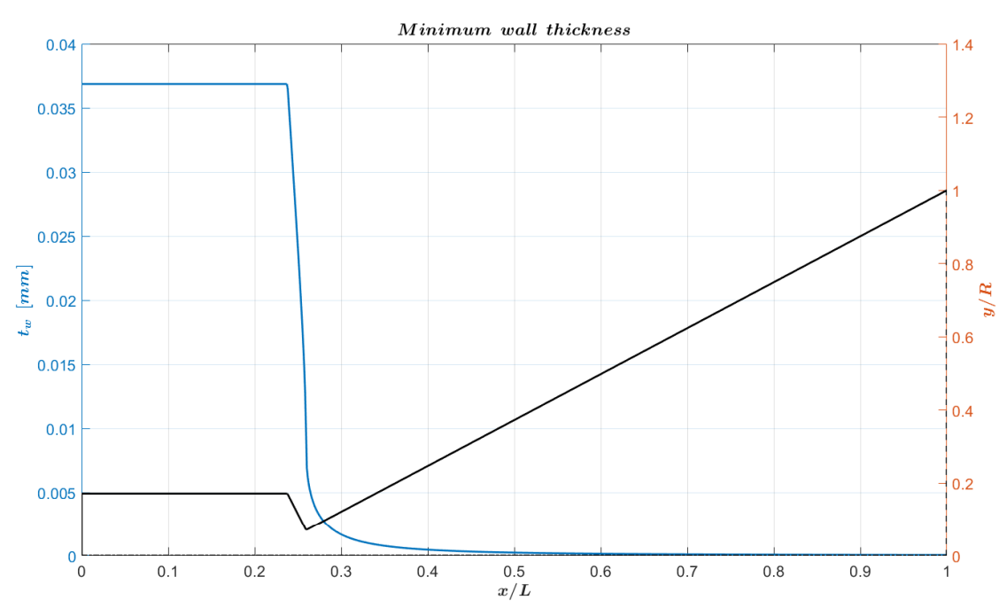

A much smaller assignment consisted in the internal ballistic analysis of solid rocket motors. From Ballistic Test and Evaluation System (BATES) results at the lab (pressure traces), Vielle's law parameters were statistically derived to get the expected performance.

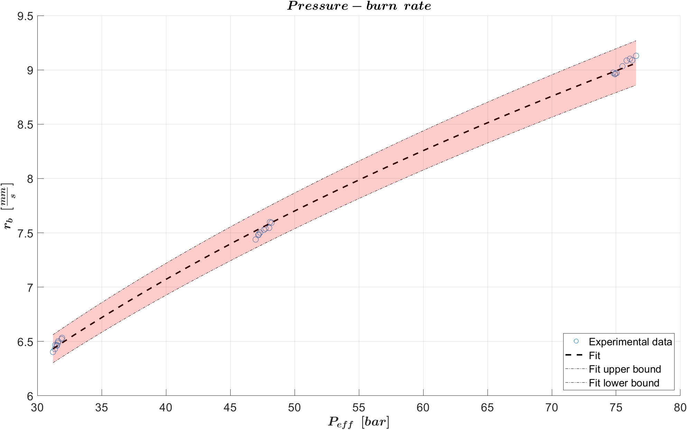

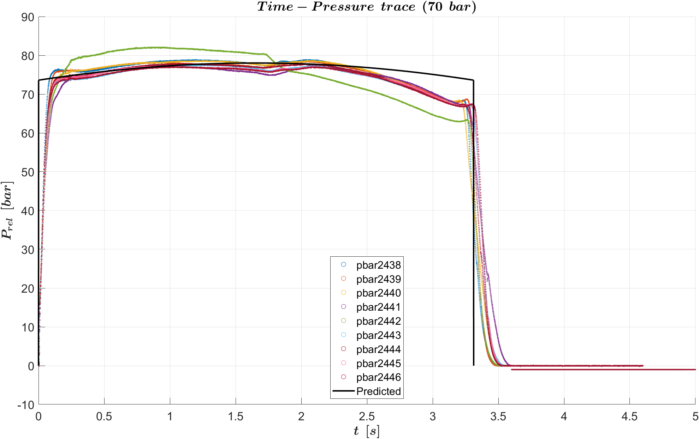

## Payload Design [PD]

Preliminary **design of an instrument** with the same goals as KaRIn in the SWOT mission. Using **MATLAB** as well, I worked in the **environmental** analysis (specifically **tides**, **atmospheric attenuation** and orbit **perturbations**) , **orbit design** (accounting for **tidal aliasing** and **tidal separability** requirements) and Interferometric Synthetic Aperture Radar (**InSAR**) setup: radar equation and interferometric baseline preliminary design. Very lengthy, well researched and interesting for me.

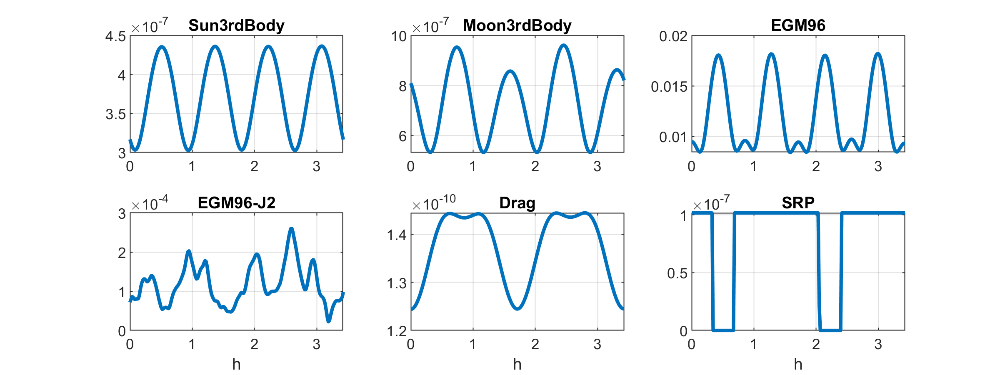

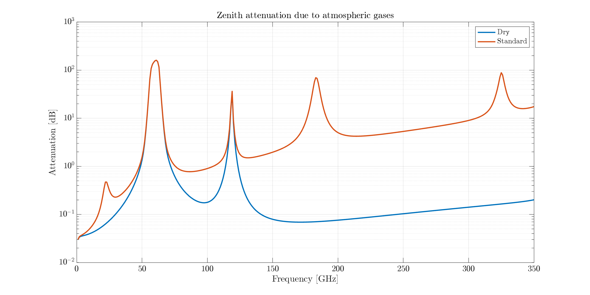

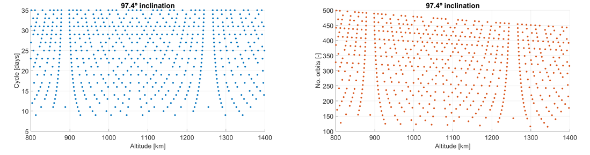

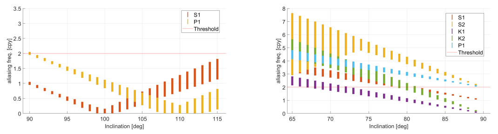

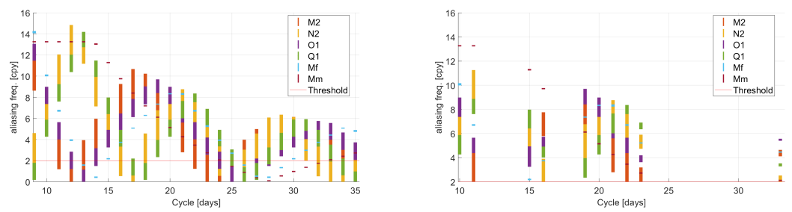

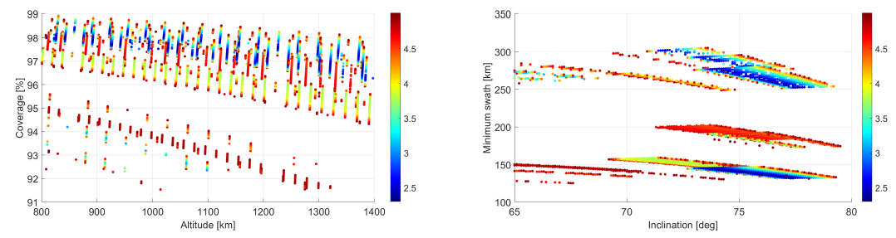

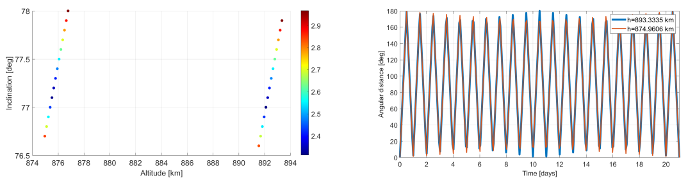

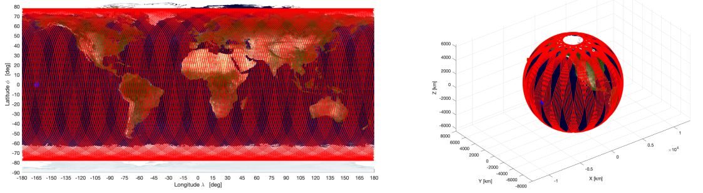